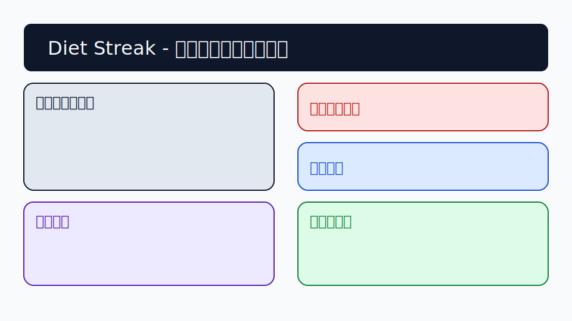

# Diet Streak

個人利用の体重記録アプリです。Firebase 認証と Firestore を利用し、日々の体重記録・ストリーク・目標管理・食事ヒント表示を 1 つのダッシュボードで行えます。モバイルファーストのカード UI とライト / ダーク両対応のデザインで、継続記録をサポートします。

## 主な機能

- Firebase Auth (Email / Password) によるログイン・サインアップ
- 今日の体重入力 (日付の自動 / 手動切り替え、任意メモ)
- ストリーク🔥表示（現在 / 最高日数、1 日の区切り時刻設定対応）
- 目標体重に合わせた進捗バーと差分表示
- 食事ヒント (控えめ / 維持 / 活動高め) のテンプレート表示
- 直近履歴カード（3 件）と詳細履歴ページ（30 件 + 折れ線グラフ日/週/月切り替え）
- CSV ダウンロードによる履歴エクスポート（日付, 体重, メモ）
- プロフィール編集（身長は任意）と 1 日の区切り時刻設定
- Firestore セキュリティルールで本人データのみアクセス可

## 画面イメージ



## 使い方フロー

1. **ログイン / 新規登録**: メールアドレスとパスワードを入力して Firebase Auth に接続します。
2. **体重を記録**: ホーム上部のフォームで体重・メモを入力。日付は自動（今日）/手動切り替えが可能です。
3. **グラフ・ストリーク確認**: ホームでストリークと進捗を確認し、`/history` ページで折れ線グラフ（日 / 週 / 月）と履歴一覧（直近 30 件）を閲覧します。
4. **CSV エクスポート**: `/settings` ページのエクスポートボタンから体重履歴を CSV（`date,weight,note`）としてダウンロードできます。

## ディレクトリ構成 (抜粋)

```
app/
  page.tsx           # ホーム (体重入力・ストリーク・進捗・ヒント)
  history/page.tsx   # 履歴とグラフ
  settings/page.tsx  # プロフィール設定と CSV エクスポート
components/          # UI コンポーネント (カード、フォーム、認証など)
lib/
  firebase.ts        # Firebase 初期化
  streak.ts          # ストリーク計算ロジック (テストあり)
__tests__/           # Vitest によるストリークユニットテスト
public/screenshots/  # README 用ダミースクリーンショット
```

## 動作環境

- Node.js 18 以上 (Vercel の推奨バージョン)
- npm 9 以上
- Firebase プロジェクト (Auth / Firestore 有効化済み)

### 環境変数設定例 (`.env.local`)

```
NEXT_PUBLIC_FIREBASE_API_KEY=your-api-key
NEXT_PUBLIC_FIREBASE_AUTH_DOMAIN=your-project.firebaseapp.com
NEXT_PUBLIC_FIREBASE_PROJECT_ID=your-project-id
NEXT_PUBLIC_FIREBASE_STORAGE_BUCKET=your-project.appspot.com
NEXT_PUBLIC_FIREBASE_MESSAGING_SENDER_ID=1234567890
NEXT_PUBLIC_FIREBASE_APP_ID=1:1234567890:web:abcdefg
```

Vercel にデプロイする際も同じキーを **Environment Variables** に登録してください。(`.env` ではなく `.env.local` を使用するとローカルで Next.js が読み込みます。)

## Firebase Firestore スキーマ例

```
users/{uid}
  goalWeight: number | null
  hintMode: 'light' | 'maintain' | 'active'
  dayBoundaryHour: number (0-23)
  height: number | null
  createdAt: ISO8601 string

users/{uid}/weights/{docId}
  date: ISO8601 string (記録日時)
  weight: number
  note: string
  createdAt: ISO8601 string
```

サンプルデータ:

```json
{
  "goalWeight": 62.0,
  "hintMode": "maintain",
  "dayBoundaryHour": 0,
  "height": 168,
  "createdAt": "2024-01-01T09:00:00.000Z"
}
```

`weights` コレクション例:

```json
{
  "date": "2024-02-05T07:30:00.000Z",
  "weight": 63.4,
  "note": "夕食軽め",
  "createdAt": "2024-02-05T07:31:00.000Z"
}
```

## Firestore セキュリティルール例

```js
rules_version = '2';
service cloud.firestore {
  match /databases/{database}/documents {
    match /users/{userId}/{document=**} {
      allow read, write: if request.auth != null && request.auth.uid == userId;
    }
  }
}
```

## ローカル開発手順

1. リポジトリをクローンし、ディレクトリに移動します。
2. `npm install`
3. `.env.local` を作成し、上記の環境変数を設定します。
4. `npm run dev` で開発サーバーを起動します。

> ※この環境ではコマンド実行ができないため、実行例のみ記載しています。ローカルマシンでお試しください。

### テスト

- ストリークロジック (`lib/streak.ts`) に対して Vitest を用いたユニットテストを 1 本用意しています。
- 実行コマンド: `npm run test`
- Vercel では CI が実行されないため、必要に応じて GitHub Actions などの代替 CI を構成してください。

## Vercel へのデプロイ手順 (初心者向け)

1. GitHub などのリポジトリに本プロジェクトをプッシュします。
2. [Vercel Dashboard](https://vercel.com/) にログインし、"Add New..." → "Project" を選択します。
3. GitHub アカウントを連携し、対象リポジトリを Import します。
4. Framework は自動検出 (Next.js) に任せて問題ありません。
5. **Environment Variables** に Firebase のキー（`NEXT_PUBLIC_FIREBASE_...` 6 項目）を入力します。
6. Deploy を押すとビルドが始まり、成功後に URL が発行されます。
7. 初回アクセス時に Firebase Auth のメール / パスワードログインを有効にしていることを確認してください。

## トラブルシューティング (Codex で確認できる範囲)

| 症状 | 考えられる原因 | 対処方法 |
| ---- | --------------- | -------- |
| `npm install` で依存解決エラー | Node.js バージョンが古い | Node 18 以上に更新し再実行 |
| Firebase エラー `Missing or insufficient permissions` | Firestore ルールが未設定 | 上記ルール例の通り UID チェックを追加 |
| `.env` の値が読み込まれない | `.env.local` ではなく `.env` に記述 | Next.js は `.env.local` を優先します。Vercel では Dashboard 上で設定 |
| Firebase 初期化で `undefined` エラー | 環境変数のキー不足 | 6 つすべてを設定し、再デプロイ |
| ビルド時の TypeScript エラー | 型の未定義 / `strict` 設定 | 型定義を追加するか、該当ファイルの型を修正 |
| ストリークが正しく計算されない | 区切り時刻が想定と異なる | 設定ページで `1日の区切り時刻` を調整し再計算 |

## セキュリティ / プライバシー

- Firebase Auth のメールアドレス以外は任意入力です (身長・メモも任意)。
- 体重履歴の CSV 出力はクライアント側で Blob を生成し、外部サーバーには送信しません。
- Firestore のルールで他ユーザーのデータ参照は遮断されています。

## ライセンス

MIT License
